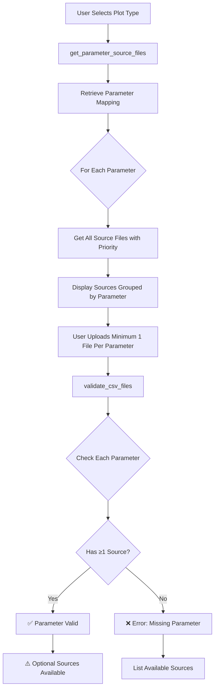

# Flexible File Requirements Implementation

**Date:** November 13, 2025  
**Module:** `validation.py`, `app.py`  
**Task:** Implement flexible file upload system where only one source file per parameter is required

## Table of Contents

1. [Executive Summary](#executive-summary)
2. [Problem Statement](#problem-statement)
3. [Solution Design](#solution-design)
4. [Implementation Details](#implementation-details)
5. [Testing Results](#testing-results)
6. [User Experience Changes](#user-experience-changes)

## Executive Summary

The file upload system has been enhanced to support **flexible multi-source parameters**. Users can now plot geotechnical data with only one source file per parameter (minimum requirement), while having the option to upload additional source files for improved data quality and redundancy.

**Key Changes:**
- ✅ Only **one source file per parameter** is required (down from all sources)
- ✅ Additional source files are **optional** and can be left empty
- ✅ UI groups files by parameter with **clear priority indicators**
- ✅ Validation provides **informative warnings** about optional sources
- ✅ All tests pass successfully

## Problem Statement

### Previous Behavior

The original implementation required **all possible source files** for a parameter to be uploaded, even though:
1. Many parameters have multiple alternative sources (e.g., UndrainedShearStrength has 5 sources)
2. Only one source is needed to generate a plot
3. Additional sources serve as backups or alternatives with different priority ranks

This created an unnecessarily rigid upload requirement where users had to upload 5 files even if they only had data from one test type.

### Example: UndrainedShearStrength Sources

Parameter: **UndrainedShearStrength**

| Priority | Source File                              | Test Type             |
| -------- | ---------------------------------------- | --------------------- |
| 1 (🥇)    | Triaxial Total Stress by Geology.csv     | Gold standard         |
| 2 (🥈)    | Vane Tests by Geology.csv                | In-situ measurement   |
| 3 (🥉)    | CPT by Geology.csv                       | Correlation           |
| 4        | SPT by Geology.csv                       | Empirical correlation |
| N/A      | Pressuremeter Test Results - General.csv | Alternative source    |

**Old requirement:** All 5 files must be uploaded  
**New requirement:** At least 1 file must be uploaded (rest are optional)

## Solution Design

### Architecture



### Key Functions

#### 1. `get_parameter_source_files()`

**Purpose:** Extract parameter-to-sources mapping with priority information

**Returns:**
```python
{
    "UndrainedShearStrength": [
        {"csv_file": "Triaxial Total Stress by Geology.csv", "priority_rank": 1},
        {"csv_file": "Vane Tests by Geology.csv", "priority_rank": 2},
        ...
    ]
}
```

#### 2. `get_required_files_from_mapping()` (Modified)

**Purpose:** Get all possible source files for selected plot types

**Returns:**
```python
{
    "all_files": Set[str],  # All possible source files
    "required_parameters": Set[str],  # Required parameters
    "parameter_sources": Dict[str, List[Dict]]  # Parameter mapping
}
```

#### 3. `_check_uploaded_files()` (Refactored)

**Purpose:** Validate that each parameter has at least one source file

**Logic:**
- For each parameter, check if at least one source file is uploaded
- **Error** if no sources found for a parameter
- **Warning** if optional sources are available but not uploaded

## Implementation Details

### validation.py Changes

#### Added Function: `get_parameter_source_files()`

```python
def get_parameter_source_files(
    mapping_path: Path, plot_types: List[str]
) -> Dict[str, List[Dict[str, Any]]]:
    """
    Get all possible source files for each parameter, with priority information.
    """
```

**Key Features:**
- Reads mapping CSV to extract parameter-source relationships
- Includes priority ranks for each source
- Sorts sources by priority (lower number = higher priority)

#### Modified Function: `get_required_files_from_mapping()`

**Changes:**
- Now returns `all_files` instead of `required_files`
- Adds `parameter_sources` dict to return value
- Uses `get_parameter_source_files()` internally

#### Refactored Function: `_check_uploaded_files()`

**Changes:**
- Now accepts `parameter_sources` dict instead of flat file set
- Checks each parameter individually
- Generates informative error messages with available sources
- Warns about optional sources when only partial sources uploaded

**Validation Logic:**
```python
for param, sources in parameter_sources.items():
    found_sources = []
    for source in sources:
        if source_file_uploaded:
            found_sources.append(source)
    
    if not found_sources:
        # ERROR: Parameter has no sources
    else:
        # WARNING: Optional sources available
```

### app.py Changes

#### Modified File Upload UI

**Changes:**
- Files now grouped by parameter in expandable sections
- Each parameter shows minimum requirement (1 of N sources)
- Priority indicators added (🥇 🥈 🥉 for ranks 1-3)
- Help text shows recommended vs optional sources

**UI Structure:**
```
📊 Parameter: UndrainedShearStrength (minimum 1 of 5 sources required)
  🥇 Triaxial Total Stress - Highest Priority
  🥈 Vane Tests - High Priority
  🥉 CPT - Medium Priority
  📄 SPT - Priority 4
  📄 Pressuremeter Test Results - General
```

## Testing Results

### Test Suite: `test_flexible_file_requirements.py`

All 5 tests passed successfully:

#### Test 1: Parameter Source Mapping ✅
- **Verified:** UndrainedShearStrength has 5 sources
- **Verified:** Sources have correct priority ranks
- **Result:** PASSED

#### Test 2: All Files vs Required Parameter Coverage ✅
- **Verified:** `all_files` contains all 5 source files
- **Verified:** `parameter_sources` structure is correct
- **Result:** PASSED

#### Test 3: Validation with Minimum Sources ✅
- **Scenario:** Only Triaxial Total Stress uploaded (priority 1)
- **Expected:** Validation passes
- **Warning:** "Using 1 of 5 available sources. Additional optional sources..."
- **Result:** PASSED

#### Test 4: Validation with Missing Parameter ✅
- **Scenario:** No source files uploaded for UndrainedShearStrength
- **Expected:** Validation fails with error listing available sources
- **Error:** "Parameter 'UndrainedShearStrength' requires at least one source file"
- **Result:** PASSED

#### Test 5: A-line Requirements ✅
- **Verified:** LiquidLimit and PlasticityIndex both from Classification by Geology.csv
- **Verified:** Single source for both parameters
- **Result:** PASSED

### Test Output Summary

```
================================================================================
✅ ALL TESTS PASSED!
================================================================================

Summary:
  ✅ Parameter source mapping works correctly
  ✅ File requirements structure is correct
  ✅ Validation passes with minimum required sources
  ✅ Validation fails when parameters have no sources
  ✅ A-line requirements correctly identified
```

## User Experience Changes

### Before

1. **Rigid Requirements**
   - All 5 source files required for UndrainedShearStrength
   - Confusing error messages listing all missing files
   - No indication of priority or alternatives

2. **Upload UI**
   - Flat list of all required files
   - No grouping by parameter
   - No priority information

### After

1. **Flexible Requirements**
   - Only 1 source file required per parameter
   - Additional sources are optional
   - Clear error messages with available alternatives

2. **Enhanced Upload UI**
   - Files grouped by parameter
   - Expandable sections showing "minimum 1 of N sources required"
   - Priority indicators (🥇 🥈 🥉)
   - Help text distinguishing recommended vs optional sources

3. **Informative Validation**
   - **Errors** only when parameter has zero sources
   - **Warnings** when optional sources available
   - Lists available alternatives in error messages

### Example User Workflow

**Scenario:** User wants to generate Undrained Shear Strength plot

1. **Select Plot Type:** "Strength"

2. **View Requirements:**
   ```
   📈 Parameter: UndrainedShearStrength (minimum 1 of 5 sources required)
   
   Upload at least one source file for UndrainedShearStrength.
   Files are listed in priority order (1=highest).
   ```

3. **Upload Minimum Files:**
   - ✅ Location Details.csv (required)
   - ✅ Triaxial Total Stress by Geology.csv (priority 1)
   - ⚪ Vane Tests by Geology.csv (optional - left empty)
   - ⚪ CPT by Geology.csv (optional - left empty)
   - ⚪ SPT by Geology.csv (optional - left empty)
   - ⚪ Pressuremeter Test Results (optional - left empty)

4. **Validate:**
   ```
   ✅ All files validated successfully!
   
   ⚠️ Warnings:
     • Parameter 'UndrainedShearStrength': Using 1 of 5 available sources. 
       Additional optional sources: Vane Tests (priority 2.0), 
       CPT (priority 3.0), SPT (priority 4.0)...
   ```

5. **Generate Plot:** ✅ Success with single source file

## Benefits

1. **Reduced Upload Burden**
   - Users only need to upload files they actually have
   - No need to provide dummy files for missing test types

2. **Improved Clarity**
   - Clear understanding of minimum requirements
   - Priority system helps users choose best source

3. **Better Error Messages**
   - Errors only for truly missing parameters
   - Warnings provide guidance on optional improvements

4. **Flexibility**
   - Users can upload additional sources if available
   - System gracefully handles partial data sets

## Future Enhancements

Potential improvements for future iterations:

1. **Data Quality Indicators**
   - Show which uploaded source has highest priority
   - Highlight if user uploaded lower-priority sources

2. **Multi-Source Merging**
   - Automatically merge data from multiple sources
   - Use priority ranks to resolve conflicts

3. **Source Recommendations**
   - Suggest which optional sources would most improve results
   - Show data coverage gaps

## Conclusion

The flexible file requirements system successfully addresses the user's need to plot geotechnical data with partial data sets. The implementation:

- ✅ Maintains data integrity (minimum 1 source per parameter)
- ✅ Provides clear, informative UI
- ✅ Passes all validation tests
- ✅ Improves user experience significantly

**Status:** ✅ Implementation complete and tested
